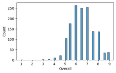
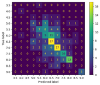
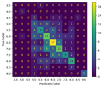

# Построение модели, способной прогнозировать оценку письменной части языкового экзамена IELTS

## *Описание проекта*
Целью проекта было построить модель, способную прогнозировать оценку письменной части языкового экзамена IELTS. Основной интерес представляло построение достаточно эффективной модели с использованием только сравнительно простых моделей и их ансамблей. Таким образом, модель сможет опираться только на локальные структуры текста, что не сможет полность отразить соответствие ответа теме и стилю.

### <a id="content">*Содержание*</a>

[Данные](#data)

[Описание работы](#model)

[Итоговое тестирование](#result)

## <a id="data">*Данные*</a>

В качестве данных использовался датасет https://www.kaggle.com/datasets/mazlumi/ielts-writing-scored-essays-dataset. В нем содержатся данные о письменных частях в сданных экзаменах IELTS.

Он содержит следующие данные:
+ отметка о типе задания;
+ текст вопроса;
+ тест ответа, написанного кандидатом;
+ комментарий экзаменатора;
+ итоговая оценка.

В датесете также присутствуют колонки Task Response, Coherence/Cohesion, Lexical Resource и Grammatical Range and Accuracy. Но, к сожалению, они не заполнены, поэтому мы не сможем имитировать процедуру оценки по всем критериям, как это происходит в реальности, и не сможем “подсмотреть” в каком аспекте мы ошибаемся больше.

Результаты экзамена оцениваются по шкале 0.0 до 9.0, с шагом 0.5. Задача кажется похожей на регрессию, но в проекте задача рассмотрена как многоклассовая классификация. При изучении порядка оценки, оказалось что ее проводят по соответствию текста определенным критериям, то есть это не постепенное начисление баллов за разные аспекты ответа, а его классификация.

---
### EDA

Изначально имеем 4 колонки: тип вопроса, текст вопроса, текст ответа и итоговая оценка ([тетрадка](https://github.com/Na-ta-ly/IELTS_writing_assessor/blob/main/EDA_%20and_Preprocess_data.ipynb)).

Если говорить о распределении данных по типу задания, то оно практически равномерное.

Кроме того, существует разница между заданиями первого типа: академический IELTS предполагает описание графика или рисунка, а общий – написание письма. В результате проверки данные оказались однородными и по этому параметру: все задания относятся только к академической версии.

Если говорить о целевой переменной, то значения распределены крайне неравномерно и некоторые классы представлены слабо. Более того, классы 1.0 и 3.0 имеют 1 и 2 представителя соответственно. Очевидно, что данных для обучения по этим классам недостаточно, поэтому эти 2 класса в дальнейшем исключим из работы.

### Генерация новых признаков

[К содержанию](#content)

([тетрадка](https://github.com/Na-ta-ly/IELTS_writing_assessor/blob/main/features_generator.ipynb))

#### 1. Отражение лексического разнообразия ответа

>Для этого были собраны списки слов разных уровней по классификации CEFR с [сайта Кембриджского словаря](https://dictionary.cambridge.org/dictionary/english/) и посчитано количество слов каждого уровня, встретившихся в тексте ответа. Кроме того, был использован список из 570 часто встречающихся академических слов, разработанный Школе лингвистики и прикладных языковых исследований Университета Виктории в Веллингтоне (Новая Зеландия).

#### 2. Отражение степени соответствия ответа вопросу
>Для отражения связи между текстом вопроса и ответа, вычислили cosine_similarity между эмбеддингом вопроса и суммарным эмбеддингом каждого абзаца, полученного суммой эмбеддингов их предложений. При этом эмбеддинги были получены с помощью предобученной модели Word2Vec (‘GoogleNews-vectors-negative300.bin.gz’) из Gensim.
>
>Соответственно, для каждого текста ответа получился ряд значений cosine_similarity, соответствующий количеству абзацев в тексте. В окончательные данные добавили максимальное, минимальное и среднее значения.

#### 3. Метрики удобочитаемости
>Для генерации дополнительных признаков использовалась библиотека readability. В ней содержится реализация метрик удобочитаемости, основанных на поверхностных характеристиках текста (линейные регрессии, основанные на количестве слов, слогов и предложений). Примерами характеристик, которые можно найти в этой библиотеке, могут служить среднее количество букв в слове, автоматический индекс удобочитаемости (ARI) или индекс удобочитаемости LIX.

После генерации признаков получилось суммарно 48 колонок данных; после отбрасывания сильно скоррелированных их осталось 29.

## <a id="model">*Описание работы*</a>
[К содержанию](#content)

Работа состояла из следующих этапов ([тетрадка](https://github.com/Na-ta-ly/IELTS_writing_assessor/blob/main/IELTS_analysis.ipynb)):

#### *1. Лемматизация*

>Лемматизацию и токенизацию проводили с помощью spacy.

#### *2. Разбиение данных*

>Данные разбили на train, test и validation в соотношении 70:15:15 со стратификацией по итоговой оценке.

#### *3. Векторизация текстовых данных*

>При построении моделей векторизация проводилась с помощью TfidfVectorizer. Оптимальные параметры векторизации были подобраны 1 раз для базовой модели и использовлись далее во всей работе.

#### *4. Построение логистической регрессии (baseline)*

>В качестве baseline была построена логистическая регрессия, обученная на данных представленных в датасете изначально, то есть колонках 'Essay', 'Question', 'Task_Type'.

#### *5. Проверка эффективности сгенерированных признаков*

>Для этой проверки была использована логистическая регрессия, обученная на двух наборах признаков: все признаки и уменьшенный набор, без сильно скоррелированных признаков.
>
>На данном этапе не выявлено никакого решающего влияния признаков.

#### *6. Проверка эффективности разных моделей*

>Для этой проверки был использован набор данных без признаков с сильной корреляцией. При этом при подборе оптимальных параметров для градиентного бустинга, случайного леса и SVC использовалась optuna и валидационной набор данных, а CatBoost был взят с параметрами по умолчанию.
>
>Модели показавшие наилучшие результаты, показали большую разницу в точности для тестовой и валидационной выборок. Кроме того, даже модели с одинаковыми значениями accuracy_score имеют разные матрицы ошибок. Возможно, это можно компенсировать ансамблированием разных моделей.
>
>***Матрицы ошибок для test_set (accuracy_score 0.386)***
>| GradientBoosting | SVC |
>| ----------- | ----------- |
>|     |    |
>
>
>***accuracy_score для разных моделей***
><table>
>    <tr>
>        <th></th> 
>        <th>baseline</th>
>        <th>LogRegr</th>
>        <th>GradientBoost</th>
>        <th>RandForest</th>
>        <th>SVC</th>
>        <th>CatBoost</th>
>        <th>VotingClassif</th> 
>    </tr>
>    <tr>
>        <th>train time</th>
>        <th>6.03s</th>
>        <th>4.51s</th>
>        <th>2min 12s</th>
>        <th>2.75s</th>
>        <th>2.23s</th>
>        <th>36.2s</th>
>        <th>2min 40s</th>  
>    </tr>
>    <tr>
>        <th>validation_set</th>
>        <th>0.395</th>
>        <th>0.391</th>
>        <th>0.423</th>
>        <th>0.433</th>
>        <th>0.395</th>
>        <th>0.405</th>
>        <th>0.405</th>  
>    </tr>
>    <tr>
>        <th>test_set</th>
>        <th>0.381</th>
>        <th>0.367</th>
>        <th>0.386</th>
>        <th>0.451</th>
>        <th>0.386</th>
>        <th>0.479</th>
>        <th>0.414</th>  
>    </tr>
></table>

#### *7. Составление ансамбля из разных моделей*

>На этом этапе был составлен ансамбль всех этих пяти моделей, чтобы они компенсировали ошибки друг друга. Для этого был применен VotingClassifier с подбором оптимальных весов для моделей.

#### *8. Проверка эффективности сгенерированных признаков на ансамбле и наиболее эффективной модели*

>Теперь для лучшей модели из пункта 6 (RandomForestClassifier) и VotingClassifier из пункта 7, сравнили эффективность на 5 наборах данных:
>+ изначально представленные в датасете (1)
>+ все признаки, вместе со всеми сгенерированными (2)
>+ все признаки, без сильно скоррелированных (на них проводился отбор наиболее эффективной модели ранее) (3)
>+ начальные признаки + “простые” признаки (сгенерированные первыми 2 путями: количество слов разных уровней и “похожесть” вопроса на ответ) (4)
>+ начальные признаки + “сложные” признаки (полученные с помощью readability) (5)
>  
><table>
>    <tr>
>        <th></th>
>        <th>Признаки (1)</th>
>        <th>Признаки (2)</th>
>        <th>Признаки (3)</th>
>        <th>Признаки (4)</th>
>        <th>Признаки (5)</th>
>    </tr>
>    <tr>
>        <th>RandomForestClassifier</th>
>    </tr>
>    <tr>
>        <th>validation_set</th>
>        <th>0.381</th>
>        <th>0.386</th>
>        <th>0.433</th>
>        <th>0.386</th>
>        <th>0.391</th>
>    </tr>
>    <tr>
>        <th>test_set</th>
>        <th>0.367</th>
>        <th>0.465</th>
>        <th>0.451</th>
>        <th>0.437</th>
>        <th>0.442</th>
>    </tr>
>    <tr>
>        <th>VotingClassifier</th>
>    </tr>
>    <tr>
>        <th>validation_set</th>
>        <th>0.409</th>
>        <th>0.428</th>
>        <th>0.405</th>
>        <th>0.414</th>
>        <th>0.391</th>
>    </tr>
>    <tr>
>        <th>test_set</th>
>        <th>0.405</th>
>        <th>0.423</th>
>        <th>0.414</th>
>        <th>0.409</th>
>        <th>0.437</th>
>    </tr>
></table>
>Наиболее эффективными оказались RandomForest, обученный на нескоррелированных данных и VotingClassifier, обученный на всех данных.

#### <a id="result">*9. Итоговое тестирование*</a>

[К содержанию](#content)

В связи с небольшим количеством данных, тестирование лучших моделей было проведено с помощью “независимого” теста.

Проверка заключалась в использовании сервиса [Write & Improve от Cambridge](https://writeandimprove.com/). В нем предлагается написать эссе на предложенную тему и система его оценивает. Однако, здесь выставляется общая оценка за пару из задания первого и второго типов, поэтому в эксперименте предполагалось, что обе части получили одинаковый балл.

Тестовая пара текстов была оценена сервисом в 7.0 баллов. Построенный RandomForestClassifier оценил  тестовые образцы в 6.0 и 7.0 баллов, а VotingClassifier – в 7.0 и 6.5. У обеих моделей вышла хорошая точность, хотя VotingClassifier в целом дает более равномерные результаты.

---

***Итог:***в результате работы были построены 2 модели, которые без использования нейронных сетей способны прогнозировать итоговый балл с приемлемой точностью.

Безусловно, необходимо учесть, что класс 7.0, использованный для теста, имел достаточное количество данных для обучения, но для сравнительно простых моделей этот результат все равно неожиданно высокий. Это подтверждает идею, что при достаточном количестве данных можно и сложные задачи успешно решать простыми моделями.
